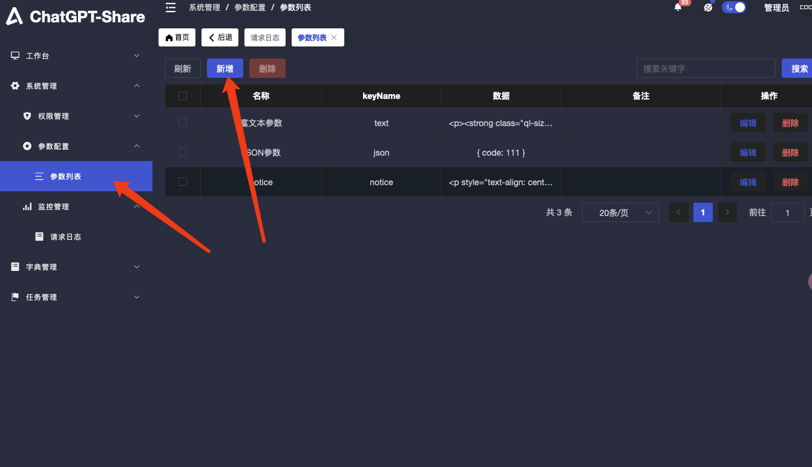
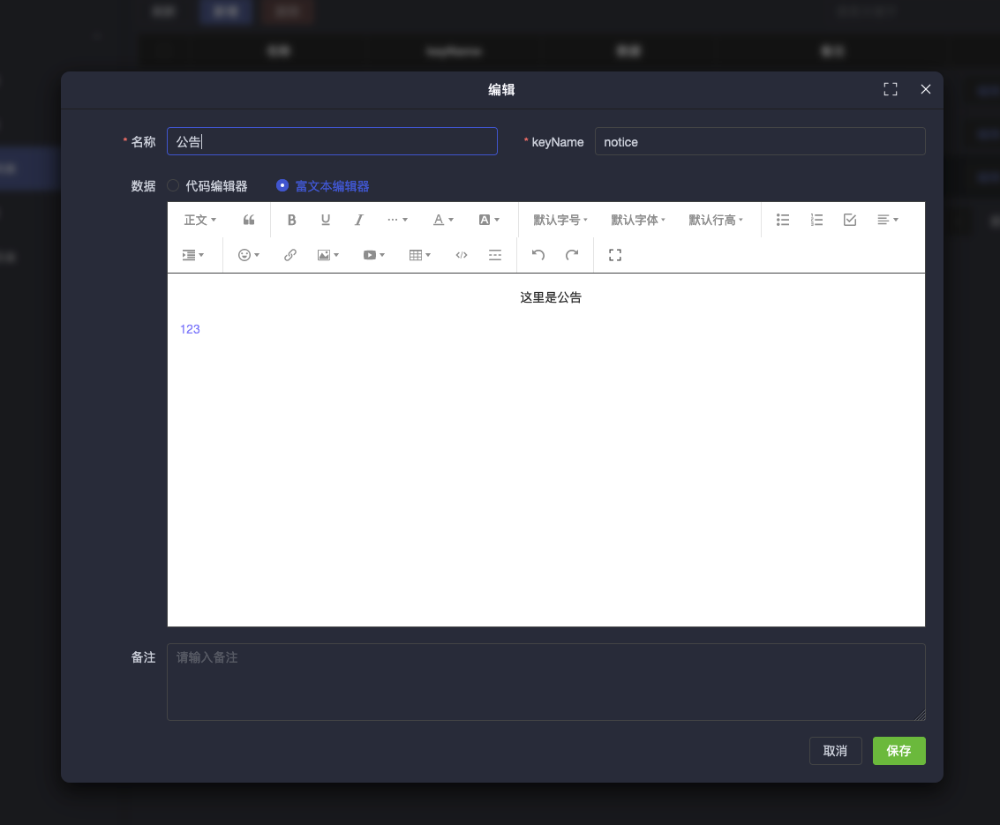

# 选车页面

选车页面(list)是一个列表页面,用于在用户登陆前以及登陆后选车使用。

默认集成的选车页面源码在 github 上的地址为: [https://github.com/Hanwencc/car-list](https://github.com/Hanwencc/car-list)

## 自定义替换选车页面

将任意编译后的静态页面放置在`chatgpt-share/list`目录下.

然后修改`docker-compose.yml`,增加 list 到 volumes 中,例如:

```yaml{17}
  chatgpt-share-server:
    image: xyhelper/chatgpt-share-server:latest
    restart: always
    ports:
      - 8300:8001
    environment:
      TZ: Asia/Shanghai # 指定时区
      # 接入网关地址
      CHATPROXY: "https://demo.xyhelper.cn"
      # 接入网关的authkey
      AUTHKEY: "xyhelper"
      # 内容审核及速率限制
      AUDIT_LIMIT_URL: "http://auditlimit:8080/audit_limit"
    volumes:
      - ./config.yaml:/app/config.yaml
      - ./data/chatgpt-share-server/:/app/data/
      - ./list:/app/resource/public/list  # 这里增加了list~~~~~~~~~~~~~
    labels:
      - "com.centurylinklabs.watchtower.scope=xyhelper-chatgpt-share-server"
```

:::tip
选车页面可以用你喜欢的任意前端框架编写,只要编译后的静态页面放置在`chatgpt-share/list`目录下即可.

首页的文件名必须为`index.html`.

路由模式必须为`hash`模式.
:::

## 公告配置

在管理后台-系统设置-参数配置-参数列表中新增参数`notice`，值为公告内容，支持 html 标签，如下图所示：



## 选车页面的数据源

TODO: 选车页面的数据源
